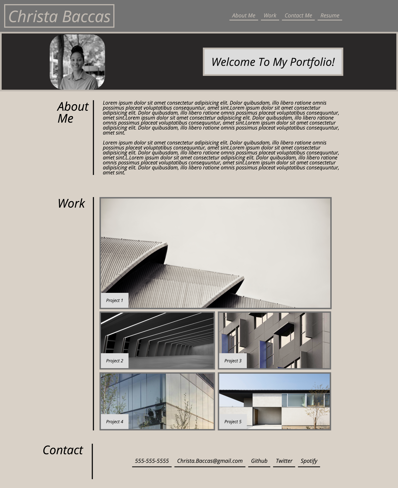

# HOMEWORK2_PORTFOLIO
## Description
The purpose of this project was to create a personal profolio to have all projects for users to view. 
In this project I've included the use of semantic tag, media queries, pseudo classes.
- Header: Includes a header includes a main header of my name and a navigation bar in whic if you click will link you to parts of the page
- Subheader: Inlcudes a photo of myself along with a subheader title welcoming you to my protfolio
- Main:
    - About me: Two paragraphs
    - Work: 5 images in a flex container what will link you to future projects
            - The main photo will link you to Project One
            - Phots named weather bashboard and day planner has the assingment attached when clicked on
    - Contact: Footer section that have navigation links of my contact information. 
              Clicking on the email will open a draft and clicking on github will direct you to my github
## Link

https://christa-baccas.github.io/HOMEWORK2_PORTFOLIO/

## Screenshot

## Resources and Assistance Used
- Worked with class members and tutor
- W3Schools 
- Youtube
